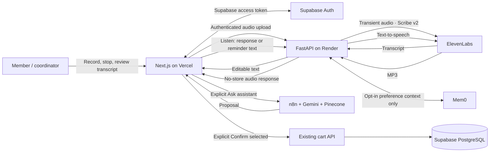

# ElevenLabs voice integration

Voice is an input/output adapter around the existing shared-cart workflow. It has no authority to add items, authorize members, commit cash, or change fulfilment.

## System interactions



The existing Next.js assistant route still retrieves consented preference context through FastAPI before forwarding the message to n8n. Audio is never sent to Mem0. The diagram combines separate interactions for clarity; transcription does not call the assistant or cart APIs.

## Enable on Render

Set these **backend environment variables**, then deploy this code:

```dotenv
ELEVENLABS_ENABLED=true
ELEVENLABS_API_KEY=<your server-side key>
ELEVENLABS_VOICE_ID=<a voice available to your ElevenLabs account>
ELEVENLABS_STT_MODEL_ID=scribe_v2
ELEVENLABS_TTS_MODEL_ID=eleven_multilingual_v2
```

The key needs speech-to-text and text-to-speech access. Do not put the key in Vercel public variables, JavaScript, the repository, screenshots, or logs. Keep the existing `NEXT_PUBLIC_API_BASE_URL` and CORS configuration pointing from Vercel to Render; no new frontend secret is required.

All provider requests set `enable_logging=false` to honor the architecture's audio-retention requirement. ElevenLabs documents zero-retention mode as an enterprise capability. Confirm the account supports it before enabling the feature. If the provider rejects zero-retention, the integration fails back to text; it never silently retries with logging enabled. A future decision to permit provider retention needs a separate explicit consent/retention design.

`ELEVENLABS_ENABLED=false` disables provider calls without affecting text input or the normal cart journey. Leaving `ELEVENLABS_VOICE_ID` empty permits transcription when enabled but keeps spoken playback unavailable.

## Product flow

1. Open the assistant and choose **Record request**. The UI explains that recording sends audio to ElevenLabs.
2. Grant microphone permission, speak, and choose **Stop and transcribe**. Recording stops automatically at 60 seconds.
3. Review/edit the returned transcript. Nothing has been sent to the shopping assistant or added to the cart.
4. Choose **Ask assistant**, review the proposal, then use the existing **Confirm selected** action.
5. Choose **Listen with ElevenLabs** on an assistant response or notification to hear it. Playback is user-triggered, including for cutoff and fulfilment reminders; it does not send unsolicited audio notifications.
6. Closing the drawer or changing account cancels pending requests, stops microphone tracks/playback, and discards local audio URLs.

The ordinary text field and visible notification text remain available if microphone permission is refused, recording is unsupported, voice is disabled, or the provider fails. The old browser speech recognition implementation is replaced by ElevenLabs transcription; no silent switch to another speech provider occurs.

## API and limits

| Endpoint | Input | Output |
| --- | --- | --- |
| `GET /api/voice/status` | Supabase token | Configuration flags and recording limits, never secrets |
| `POST /api/voice/transcribe` | Supabase token, raw audio body | Transcript and `requiresConfirmation: true` |
| `POST /api/voice/speak` | Supabase token, JSON `{ "text": "..." }` | MP3 response |

Voice actions require an active shopper profile. Audio bodies are read into bounded transient memory, not multipart disk storage: max 5 MiB, supported WebM/Ogg/MP4/WAV/MP3 MIME types. The browser caps capture at 60 seconds; the backend enforces byte size rather than decoding duration. Speech text is limited to 1,200 characters and output audio to 2 MB. Each user gets 10 actions per minute per backend process. This is an MVP local quota, not a shared cross-worker billing limit; set account budgets and a shared gateway limit before horizontal scaling.

Provider requests time out and fail without echoing provider bodies or logging audio/transcripts. Responses use `Cache-Control: no-store`. The app persists neither uploads nor generated playback. No provider-generated audio or transcript is saved as a Mem0 preference.

`/health` reports `voiceTranscription` and `voicePlayback` configuration readiness. These flags do not establish credential validity or successful provider calls.

## Verification

Automated backend tests cover authentication, forbidden profiles, disabled configuration, successful multipart transcription, server-selected TTS model/voice, provider errors/timeouts, response/input bounds, per-user quotas, and no-store responses. Existing order/memory tests remain part of the full suite. Browser-component tests cover transcript delivery without assistant/cart calls, cancellation without upload, late microphone permission and transcription after unmount, permission-denied text fallback, explicit playback, and object-URL cleanup.

Local validation: 22 backend tests, 7 browser-component tests, ESLint, TypeScript and Next.js production build pass. The dependency audit reports no vulnerabilities.

After setting the key and voice ID, perform one real cloud smoke test:

- Record “Add two tubs of curd”; verify an editable transcript and an unchanged cart.
- Ask the assistant; verify a proposal; confirm once and verify the expected cart change.
- Listen to the response and an existing reminder; verify audio and stop behavior.
- Cancel recording; close the drawer during transcription/playback; sign out while voice is active.
- Deny microphone permission and disable the provider; verify text remains usable.
- Confirm neither API responses nor browser network requests reveal the ElevenLabs key.

No real ElevenLabs request was made during implementation: the API key is being configured separately by the product owner.

## Provider references

- https://elevenlabs.io/docs/api-reference/speech-to-text/convert
- https://elevenlabs.io/docs/api-reference/text-to-speech/convert
