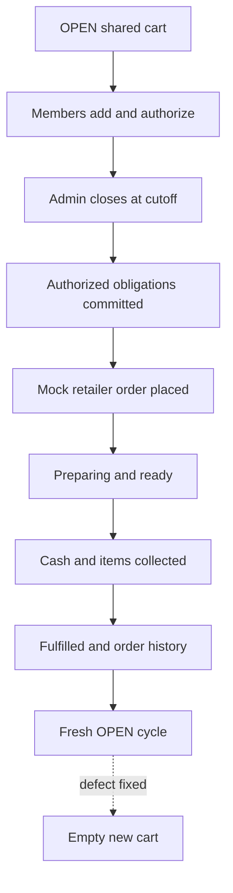

# RC3 full functional test report

Test date: 10 September 2026  
Target: Vercel production frontend + Render production backend  
Result: **Conditional pass — two production defects fixed locally and awaiting deployment/retest**

## End-to-end result

## Completed tests

| Area | Test | Result | Evidence/notes |
|---|---|---:|---|
| Authentication | Sign in as Demo Member/admin and Retail User 1 | Pass | Correct profile and role shown after each switch |
| Session isolation | Switch users without leaking previous assistant/cart/memory UI | Pass after fix | User-scoped UI is cleared and late responses are ignored |
| Authorization | Retail Users 1 and 2 authorize their own lines | Pass | Both displayed as `AUTHORIZED` |
| Cutoff | Admin force-closes demo cycle | Pass | Cycle moved to `AWAITING_COMMITMENT` |
| Allocation | Only authorized members are included | Pass | Pending Retail User 3 lines were excluded from the order |
| Cash | Retail User 1 records own commitment | Pass | Obligation changed to `COMMITTED` |
| Role policy | Retail member cannot access placement/fulfilment controls | Pass | Controls absent for member; backend policy tests also pass |
| Placement | Admin places mock retailer order | Pass | Journey moved to `PREPARING` |
| Fulfilment | Preparing → ready → cash collected → items collected → fulfilled | Pass | All transition guards and required records completed |
| Notifications | Order placement notification appears | Pass | In-app unread notification displayed |
| History | Fulfilled order appears in Orders & delivery | Pass | `SMB-45416C11`, €9.23, three products, cash collected |
| Rollover | A new `OPEN` cycle is created | Pass | New cycle was created automatically |
| Voice | Long speech becomes editable text | Pass (user verified) | Longer capture works; raw audio is not retained |
| Memory consent | Enable memory for Demo Member | Pass | Remember control became available |
| Memory isolation | Retail User 2 cannot see Retail User 1 memory | Pass (user verified) | Per-user namespaced boundary confirmed |

## Defects found in the complete round

| ID | Severity | Production behavior | Root cause | Fix status |
|---|---:|---|---|---|
| RC3-01 | High | “Preference accepted” appeared, but no memory/Forget button appeared and `milk` still returned every milk | Mem0 V3 add returns an asynchronous event; the backend treated `PENDING` as saved | Fixed locally: explicit preferences use synchronous non-inferred storage; event polling remains as a compatibility fallback |
| RC3-03 | High | A deployed fresh preference save ended with `signal timed out` | Waiting for the remote extraction pipeline inside one browser request can exceed the UI deadline | Fixed locally: explicit preference text now bypasses extraction with `infer=false`, which Mem0 processes synchronously |
| RC3-02 | Medium | The new `OPEN` cycle contained Retail User 3's previously pending lines (€5.47) | Automatic rollover copied `ROLLED_FORWARD` lines into the new cart | Fixed locally: create a clean empty cycle while retaining old-cycle audit/history |

## Required post-deployment regression

Run this exact memory sequence as Retail User 1 and again as Demo Member:

1. Enable **Remember mine**.
2. Save `I prefer oat milk and Greek yogurt`.
3. Wait for **Preference saved and ready to use** and verify the preference row and **Forget** button are visible.
4. Close/reopen the assistant; verify the row remains.
5. Ask `milk and yogurt, two each`; verify Oat Drink and Greek Yogurt are proposed and cart remains unchanged until confirmation.
6. Click **Forget**; verify the row remains absent after 15 seconds and after close/reopen.
7. Ask `milk`; verify generic milk choices are returned because the preference is gone.
8. Sign in as Retail User 2; verify User 1's preference is not visible or applied.

Then finish one short order and verify the automatically created `OPEN` cycle starts at **0 items / €0.00**.

## Environment-dependent checks

| Test | Status | Reason |
|---|---:|---|
| Real email delivery | Not applicable to demo accounts | Seeded users use non-deliverable `@sharemybread.test` addresses; in-app notifications were tested |
| Browser microphone automation | Manual pass | Browser automation cannot grant/use a human microphone reliably; user completed this check |
| Scheduled cutoff at wall-clock deadline | Configuration verified; timed run remaining | n8n workflow is active, but the tested cycle was closed manually before its future cutoff |

## Automated validation

- Frontend ESLint: pass.
- Frontend production build and TypeScript: pass.
- Backend compile: pass.
- Existing backend policy suite: six tests passed in the project virtual environment.
- Four new Mem0 service regression tests cover synchronous explicit storage, pending → succeeded, failed events, and missing event IDs; run them in the project virtual environment after applying this patch.
