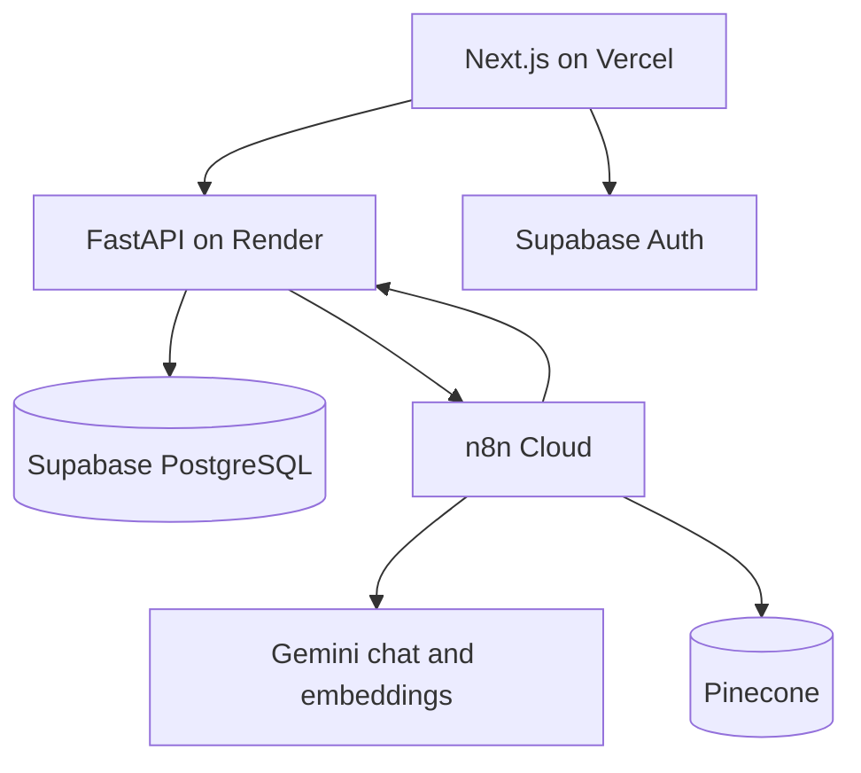

# Cloud architecture

The browser authenticates with Supabase and sends its user token to FastAPI. FastAPI validates identity, group scope, state, price, stock, cutoff, idempotency, and every mutation. n8n receives authenticated context from FastAPI, coordinates Gemini and Pinecone, and calls narrow backend tools. Pinecone returns candidate product IDs; FastAPI supplies authoritative price and stock.
